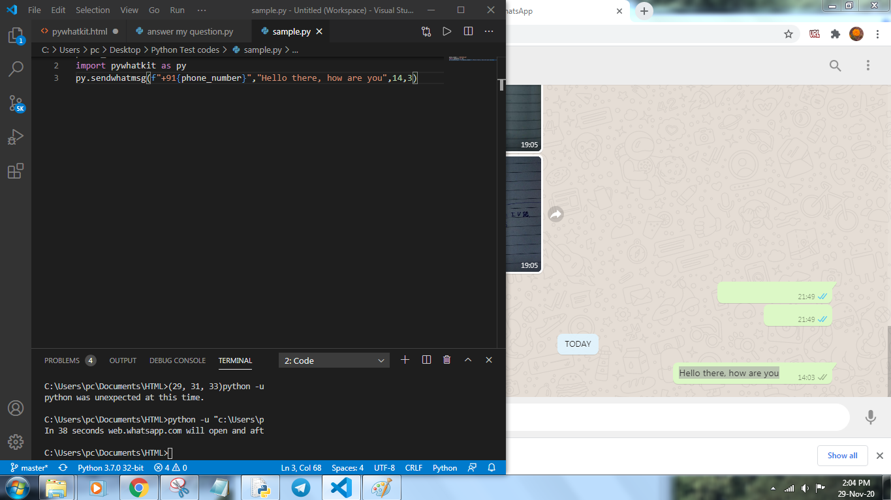

# Automate Whatsapp Messages Using Two Lines of Python Code

### Description:

You can automate WhatsApp messages with only two lines of python code. PyWhatKit is a Python library for Sending WhatsApp message at certain time, it has several other features too.  

### Installation:

This library can be installed by the pip command, open your command prompt and type in the following command...

`pip install pywhatkit`

---

### Usage:

1. Install the PyWhatKit library using terminal by the pip command given below.

```python
pip install pywhatkit
```

2.  Open new project in your preferred Python IDE 

3.  Import  pywhatkit library

```python
import pywhatkit
```

4.  Call sendwhatmsg function and enther the parameters

```python
pywhatkit.sendwhatmsg('+911234567890', 'Sample Message', 8, 23)

```

---

### Screenshots:
</img><br>
Parameters 👇

```python
phone_num
```

(required) - Phone number of target with country code

```python
message
```

(required) - Message that you want to sendwhatmsg

```python
time_hour
```

(required) - Hours at which you want to send message in 24 hour format

```python
time_min
```

(required) - Minutes at which you want to send message

```python
wait_time
```

(optional, val=20) - Seconds after which the message will be sent after opening the web

```python
print_waitTime
```

(optional, val=True) - Will print the remaining time if set to true

---
### Some Common Errors:

`CountryCodeException` - Check if the phone number passed into the parameter has country code<br>
`Message not getting delivered` - Check internet speed and increase wait_time to 30 or above <br>
`CallTimeException` - The web takes some time to load so some delay is required, make sure the seconds left is greater than the wait_time<br>
`SyntaxError` - Make sure the first two parameters are string and the rest are int<br>

---
Made with 💜.
